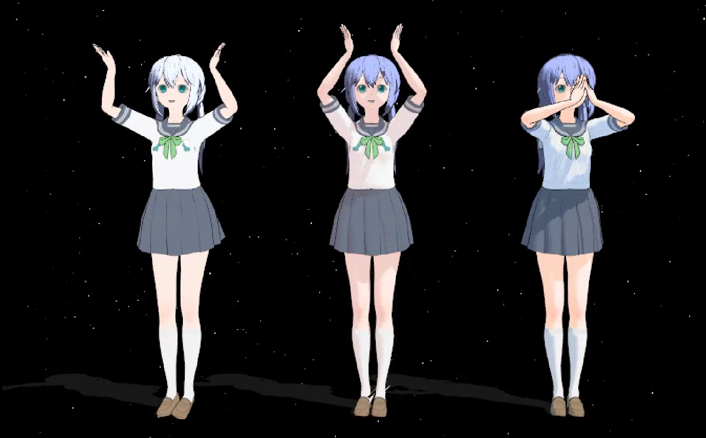

# KKPMX

This package is a tool chain to perform necessary edits to exported Koikatsu (KK) Models to be more useful for MMD.

I made it to allow others exploring the possibility of using KK as alternative to searching the Internet for models (mainly Pixiv or booru). Half of the time, the model exists and may even be decently made. But you wouldn't be here if you were satisfied with that. This project might be what you want if any of the following applies to you:

 - You simply cannot find the model you desire or don't trust shady links.
 - The model exists, but may otherwise be incomplete for your purposes (Physics, costume, Doll Anatomy, ...)
 - You want an easy way to (re)create your OC* and making it move over the screen without having to learn / buy sophisticated modeling programs.
    - *... or any target-of-affection, be it waifu or husbando.
 - You already use KK and complain about any restrictions that CharaStudio has when compared with MMD.
 - You already use the Export Mod yourself but realize that a good model takes a lot of effort to just get the basics done.

Comparing 'Bare minimum', '5min of manual edits', 'running the script' (old pic from 2022-06, needs update)

## Legal (from nuthouse01)

This code is free to use and re-distribute, but I cannot be held responsible for damages that it may or may not cause. You are permitted to examine and modify the code as you see fit, but I make no guarantees about the safety or quality of the result. 
I take no responsibility for how you use this code: any damages, or copyright violations or other illegal activity are completely the fault of the user. These tools only gives you "the ability to read/edit", what you do with that ability is not my business and not my fault. 
You are free to use this for any commercial or non-commercial applications. 
Don't try to claim this work as yours. That would be a profoundly dick move. 
---- 
Just to be clear, I extend the above terms to cover this project as well. If you liked it, try visiting nuthouse01's page, as they have a lot of additional great tools and resources to further help out with PMX models in general.

## Links & Credits

 - [nuthouse01](https://github.com/Nuthouse01/PMX-VMD-Scripting-Tools)
 - [PMXExport](https://github.com/TheOddball/KoikatsuPmxExporter/tree/master)
 - [MaterialEditor](https://www.patreon.com/posts/27881027)

If you have any questions, feel free to hit me up on Twitter DMs (https://twitter.com/@KaizoSlime)

I'd be open to convert cards for you at 5€ a piece, add 10€ for converting it to VRChat or VRM / VSeeFace. 
In the unlikely case that people actually make use of that offer, I reserve the right to increase if too many ask.

## Misc

Some less obvious things when working with Console applications

 - File paths need to be enclosed into "" if they contain ' ' (Spaces).
 - You can drag and drop files into window to avoid typing the paths.
 - If the command offers a default value, it can be choosen by pressing enter without entering anything.
 - You can press the 'Up' arrow key to retrieve the most recent instruction(s)
    - To repeat the commands for multiple input requests: Go 'up' till the first -- Enter to execute it -- Now the 'next' previous command can be accessed by pressing 'down', and so on.
 - You can enter commands and press 'enter' while no input is asked for. That way you can provide commands in advance.

## FAQ

[Issues.md](Issues.md)
[Customize.md](Customize.md)

## Recommended chain of actions

 0. [until < 1.6.1] PMXExport has a weird quirk that messes up the Editor when started the first time after starting Koikatsu. 
Return to the Title Screen and re-enter the Editor to fix it.
 0. Load the desired character and costume.
 0. Change Pose, Expression, Clothing State, or Accessory Visibility as necessary.
    - Recommended: Pose='T-Pose' (one to the left), Blinking=Off, Looking at='Top' (Slider on 0%), Mouth=Neutral. 
Alternatively (instead of 'Looking at') you can focus on yourself py pressing '5' and 'R' and then slightly moving the model straight upwards 
Any Eye and/or Mouth Position works, as long as the Eyes stay open and the mouth closed (aka Smiling, Sleepy, ...)
    - While the Tool-Chain is indifferent of whatever pose is used, it might produce funny results in MMD.
    - The same goes for facial expressions, which are further morphed by MMD-Sequences.
 0. Click on [Export] in the upper left corner -- It may take a short moment depending on size.
    - Will add a folder containing the *.pmx + main textures into `C:\koikatsu_model`, named with a random 4-digit number.
       - See the next subsection for how to use the model immediately.
 0. ~~Click on the 'Info' Tab (Heart) and then on [Generate JSON Data].~~
    >[1.5.1+] Merged this into PmxExport, so it is now created with [Export]
    - Will also add a file called `{CharName}.json` into the same folder, containing technical details for the *.exe.
 0. ~~[Old] This step is (almost) entirely optional, but improves the quality of the textures a lot and requires the [MaterialEditor]. 
The goal is to go through every asset (Body, Clothes, Accessory) and export the auxiliary textures (in most cases, ColorMask & DetailMask) 
See the [Help]-Section of [Scan Plugin File] for more details of which are currently supported.~~
    >[1.3.1+] Older versions of [PmxExport] only export the Main-Textures.  
    >I added an updated version which also exports all 'extra' textures into a folder called 'extra'
    >So there is no need to manually export the textures anymore.
    - See the [Help]-Section of [Scan Plugin File] for how to use a different name / path.
    - Note: Some assets lack a Main-Texture (like the default Fox-Tail). In such cases, the ColorMask (if any) will be used instead as base texture.
 0. Start KKPMX_core.exe, select option [(5) All-in-one converter] and follow the steps.
    - [Notes for Step(2)]: Recommended choices are: 2 (No) \ 2 (only top-level) \ 1 (Yes)

The model should be (almost) ready, but some last adjustments have to be done manually.

 0. [Edit(E)] -> Plugin(P) -> User -> Semi-Standard Bone Plugin -> Semi-Standard Bones (PMX) -> default or all (except `[Camera Bone]`)
 0. Go to the [TransformView (F9)] -> Search for [bounce] -> Set to 100% -> Menu=[File]: Update Model
 0. When making heavy use of morph sliders, adjust the order of the materials to prevent them getting invisible (inner sorted above outer).

## tl;dr: Minimum steps to make the exported model work immediately

If you just want to test out some things with minimum set of work, perform these steps:

 1. You only need the [PMXExport] Plugin for this. Do the first 4 Steps in the above list.
 2. Open the *.pmx file and go to the Materials Tab
 3. There are two assets called 'Bonelyfans' (one each for body and face); Set their Opacity to 0 & tick off [Edge Outline] (or delete them)
    - If 'Standard' or 'Shadow' exists, do the same for these. 
 4. Go to the 'Display' Tab
 5. Go through all Display-Frames: Delete any '-1' Elements appearing in the right box

The model should now work properly in MMD, but may perform weird with most TDA Dances. To further fix that:

 6. [Edit(E)] -> Plugin(P) -> User -> Semi-Standard Bone Plugin -> Semi-Standard Bones (PMX) -> default or all (except `[Camera Bone]`)
 7. Go to the [TransformView (F9)] -> Search for [bounce] -> Set to 100% -> Menu=[File]: Update Model

## To compile it yourself

To compile the project yourself, you need to install the following dependencies:

 - Tool-Chain
    - The tool was compiled and tested with Python 3.8+. (currently using 3.10)
    - To use 'kkpmx_property_parse.py', you need to install ['numpy', 'opencv-python', 'blend_modes']
    - To use 'kkpmx_handle_overhang.py', you need to install ['numpy', 'scipy', 'sympy']
    - If scipy causes issues, install it manually from https://www.lfd.uci.edu/~gohlke/pythonlibs/#scipy
    - I added all necessary files myself, but in case you are interested, they are based on [nuthouse01]'s tool (pre v6.0)
       - If you do it yourself, copy the contents of KKPMX's 'src' folder into '[nuthouse01]/python', overwrite if necessary. The changes in question are:
       - [morph_scale.py] `get_idx_in_pmxsublist()`: Extra argument to suppress 'Not found' warning to verify valid inputs when asking for materials.
       - [nuthouse01_core.py] `prompt_user_filename()`: Ignore "" around File-Paths to allow drag-drop of files into the CommandWindow.
       - [file_sort_textures.py] `main()`: Isolated initialization to allow calling with existing PMX instance.
       - [model_overall_cleanup.py] `main()`: Isolated initialization to allow calling with existing PMX instance.
       - [_alphamorph_correct.py] `template, template_minusone()`: Don't zero out morph colors.
       - [_dispframe_fix.py.py] `dispframe_fix()`: Add additional morphs to a new 'moremorphs' display so that user-defined morphs are removed last when capping the list.
 - KK Mod
    - The Mod has been compiled and tested with .NET 3.5 (same as KK)
    - All necessary packages can be installed by "Restore Packages".
    - After compilation, put the *.dll into `{KK-Folder}/BepInEx/plugins`

## What I do when working on a model (aka What to do if you don't know what to do)

 - After exporting, usually looking at the raw model to see how it looks (just out of curiosity)
    - This can also save some hassle in case something obvious isn't correct to re-export instead of wasting time.
    - And don't worry if things are visible which are hidden in KK -- This will be taken care of later.
 - Hiding materials that should stay hidden initially; They will receive a 'Show X' morph later (except if called Bonelyfans).
 - Combining identical textures used by multiple materials so that they all use the same file and removing the duplicate files.
    - Doing this avoids them being processed multiple times and simply being reused on demand.
 - Run the 'All-in-one' mode
    - Using the generated *.json when being asked for such.
 - Using a fitting processing option of [mode 4].
 - Opening 'model_cutScan.pmx' for additional edits.
    - It would be 'model_better.pmx' when skipping [mode 4].
 - Going through Rigids, setting noisy ones to 'all green'.
 - Also detangling some chains if necessary (See [Rigging Mode 3])
    - This involves either removing Rigids + Joints -or- rewire bones & rigids to split chains
    - Since I'm the dev, sometimes adding them, if possible, as pattern into the script. Only core KK assets or big enough mods are added, though.
 - Adjusting morph items that should always stay hidden / always stay visible
 - Reorder clothes into proper order
    - Proper order means 'inside' is sorted before 'outside' (e.g. Socks before Shoes, Bra before Shirt before Jacket, etc.
 - Cleanup the [Display] Group from morphs I don't need for this model.
 - Going through materials to untick 'Edge (Outline)' in severe cases (those with lots of 'black textures')
    - A lot of that should already be covered by [Prune invisible faces].
 - Apply opacity of 0.5 to glassy items
 - Adding the extra bones from 'Semi-Standard Bones Plugin (PMX)'
 - Applying the 'bounce' morph.
 - Saving as 'model.pmx'

## Help

The following section enumerates the available functions when starting [kkpmx_core].

Most modes will always create a new file and append a suffix (see [Output]).

### (0) Show help for all

>  Displays the info available in this section.

### (1) Cleanup Model

>  This is one of two main methods to make KK-Models look better.
>  It does the following things:
>  
>  - Disable "Bonelyfans", "Standard" (+ emblem if no texture)
>  - Simplify material names (removes "(Instance)" etc)
>  - After promting user for permission:
>  -  - if tex_idx != -1: Set diffRGB to `[1,1,1]` ++ add previous to comment
>  -  - else:             Set specRGB to `[diffRGB]` ++ add previous to comment
>  - If no toon: Set toon_idx = "toon02.bmp"
>  - Rename certain bones to match standard MMD better
>  - Only for KK-Models:
>  -  - Cleanup the extra items added by Clothes-to-Accessories (CTA)
>  -  - Adjust Ankle Bones to avoid twisted feet
>  -  - Replace Tongue color because it is weird by default
>  -  - Link the standard MMD bones (Arms, Legs, Torso) together
>  -  - Add a Display group for quick access of certain TrackAnchors
>  -  - Add a Display group each for Chest and Skirt bones (allows disabling their physics in MMD)
>  -  - Repair the already existing Morphs (for AEIOU, Blinking, Happy) and fix panels
>  - Remove items with idx == -1 from dispframes `[<< crashes MMD]`
>  - Fix invalid vertex morphs `[<< crashes MMD]`
>  
>  In some cases, this is already enough to make a model look good for simple animations.
>  Which is why this also standardizes color and toon,
>  
>  `[Options]` (for Automization):
>  - `[colors]`: bool -- Standardize colors (== Reset Diffuse of Materials with Textures). Asks user if None
>  
>  `[Output]`: PMX File '`[filename]`_cleaned.pmx'

### (2) Make Material morphs

>  Generates a Material Morph for each material to toggle its visibility (hide if visible, show if hidden).
>  - Note: This works for any model, not just from KK (Sorting into body-like and not might be less accurate when obscure names are used).
>  
>  #### Names & Bones
>  - If the materials have only JP names, it attempts to translate them before using as morph name (only standard from local dict).
>  - Assuming material names have indicative/simple names, also attempts to guess the role of a material
>    - (== part of the body, a piece of clothing, an accessory) and generates groups based upon that.
>    - Body parts will stay visible, but clothes / accessories can be toggled off as a whole.
>  - If the model has a standard root bone ('全ての親'), adds a morph to move the model downwards.
>    - Can be used as an alternative for moving the body downwards in MMD (e.g. when hiding shoes).
>  - If the model has a standard center bone ('センター'), adds a morph to move the body downwards.
>    - Can be used to test physics better in TransformView.
>  
>  #### Using the Plugin
>  - If the model has been decorated with Plugin Data, then the following groups will be added as well:
>    - Head Acc   :: Accessories attached to hair, head, or face
>    - Hand/Foot  :: Accessories attached to wrist, hand, ankle, or foot; incl. gloves, socks, and shoes
>    - Neck/Groin :: Accessories attached to the neck, chest, groin, or rear
>    - Body Acc   :: Accessories attached to the body in general (arms, shoulder, back, waist, leg)
>    > Tails etc., if recognized as such, will be considered part of the body and are always visible.
>    > Disabled materials (aka those set to 'Enabled=Off' in KK) will not be added to these groups.
>  
>  #### Combination rules
>  - The order of operations makes no difference in effect.
>  - Every material has its own MorphToggle, except if the user declined the inclusion of body parts recognized as such.
>  - Recognized Body parts are excluded from all "Hide all" and "Show all" morphs.
>  - If an individual morph makes a material visible again, it can be hidden by the "Hide all" morph.
>  - If an individual morph hides a material, it can be made visible again with the "Show X" morph.
>  - If a material has been hidden by any "Hide all X" morph, it can be made visible again with its "Show X" morph.
>  
>  Mode Interactions:
>  - Uses `[JSONGenerator]` Data if available -- "`[:Slot:]`"
>  - Overrides morphs if they already exist
>  
>  `[Options]` (for Automization):
>  - `[body]`:  bool -- False to ignore 'Body part' materials. Prompts if `[None]`
>  - `[group]`: bool -- True to group by accessory slot. False to generate one morph per material. Prompts if `[None]`
>  
>  `[Output]`: PMX file '`[modelname]`_morphs.pmx' -- only if 'write_model' is True

### (3) Scan Plugin File

>  This is the second of two main methods to make KK-Models look better.
>  - Note: Current/Working directory == same folder as the *.pmx file.
>  - Within the *.json file, this is abbreviated as "%PMX%".
>  
>  It will parse a processed plugin file and apply colors and shaders, as well as combining textures.
>  It also sets the visibility on customized multi-part assets and adds the accessory slots into the comment.
>  - Remarks: All texture adjustments work based on "Garbage in, Garbage out": The results are only as good as the sum of the sources.
>    - Several issues can be fixed by making sure all colors are properly set and undesirable ColorMasks are removed.
>  
>  This does require some preparations before it can be used:
>  1. A *.json file generated by `[(7) GenerateJsonFile]`
>  - Default looks for "#generateJSON.json" in the working directory
>  - Otherwise asks for the path if not found
>  2. A folder filled with extra textures exported from KK (can be done manually with the `[MaterialEditor]` mod)
>  - The path will be read from the above *.json in "options" > "base" and defaults to "./extra".
>  - Currently working / supported are:
>    - MainTex
>    - DetailMask
>    - ColorMask
>    - LineMask
>    - AlphaMask (except on Clothes)
>    - overtex1 (on body and eye)
>    - overtex2 (on eye)
>  - Not (yet) supported are:
>    - on body: overtex2
>    - on face: overtex1, overtex2, overtex3
>    - NormalMap, NormalMask
>  
>  Additional notes:
>  - After generation, the *.json file can be edited to change some aspects (some colors, visibility, textures) without KK. Re-run this to apply changes.
>  - Due to pre-generation, sometimes textures are used that do not exist (which will print a warning). Remove the item from the faulty material's template to clear the warning. Of course you can also just ignore it if you don't miss anything from the model.
>  - To override a specific texture with an irregular name, just add the Texture Name directly into the Material (see #Customize.md).
>  - Example: Add `["MainTex": "C:\full\path\to\texture.png",]` (without brackets, and using the correct path) to set a specific Main Texture (for cases like using a cloth slot multiple times (otherwise they would reuse the first one), which requires manually adding it to `[generateJSON]` to begin with)
>  
>  `[Issues]`:
>  - When using KKS, the face texture may contain blank space where the blush is supposed to be. For the time being, please merge the blush and face texture yourself in that case.
>  
>  `[Options]` (for Automization):
>  - `[apply]`: bool -- True to not wait for results and write directly to model. Prompts if `[None]`
>  
>  `[Options]` (manually):
>  - Use Texture Cache (default: Yes)´-- Reuse Textures that share the same generation parameters. If, for some reason, you do not want that it can be turned off with this. Other than the increased amount of pictures, this shouldn't behave any different (if it does, please tell me)
>  - Asks to skip pictures (default: No) -- You can skip regenerating the pictures if all files already exist as expected (otherwise it will list them as missing as usual)
>  
>  `[Output]`: PMX file '`[modelname]`_props.pmx'

### (4) Isolate protruding surfaces

>  Scans the given material(s) against bleed-through of vertices / faces poking through the surface of another.
>  > Currently will only find all protrusions going towards negative Z-Axis, and may not work for X or Y Axis.
>  
>  The initial bounding box is defined by the base material which the target is checked against
>  - Example: `[Base]` Jacket vs. Vest \ `[Target]` Body ::: Look where the body is visible through clothes
>    - Jacket: Bounding Box goes from wrist to wrist, and neck to waist. It won't scan Hands or the lower body
>    - Vest:   Bounding Box stops at the shoulders --- That means it will ignore the arms as well.
>  
>  There are three options to define the coordinates of a bounding box. All vertices outside it will be ignored.
>  - Choose best-guess defaults to remove chest protrusions on a KK-Model
>  - Input manual coordinates (for either a scan or box cut)
>  - Full scan (== full box of target against full box of base)
>  The smaller it is, the less calculations are performed and it will complete faster.
>  
>  `[Output]`: PMX file '`[modelname]`_cutScan.pmx'
>  - As opposed to usual, it will always count up instead of appending if '_cutScan' is already part of the filename
>  
>  `[Logging]`: Stores which mode, materials, and bounding box was used.

### (5) All-in-one converter

>  All-in-one Converter
>  
>  Assuming a raw, unmodified export straight from KK, this will perform several tasks.
>  All of which can be done individually through either the above list or the GUI of nuthouse01.
>  - `[ - ]` Creating a backup file with "_org" if none exists
>  - `[ 1 ]` Main cleanup of the model to make it work in MMD
>  - `[7 3]` Asking for the *.json generated by the plugin & parsing it into the model
>  - `[1-2]` Apply several rigging improvements
>  - `[1-5]` Clean up invisible faces
>  - `[ 2 ]` Optional: Adding Material Morphs to toggle them individually
>  - `[1-6]` Optional: Adding Emotion Morphs based on TDA
>  - `[Gui]` Renaming & Sorting of Texture files (== "file_sort_textures.py")
>  - `[Gui]` Running a general cleanup to reduce filesize (== "model_overall_cleanup.py")
>    - This will also add translations for most untranslated phrases in the model
>  - `[ - ]` If initially requested to not store per-step modifications, the model will be saved at this point.
>  - `[ 4 ]` Optional: Trying to fix bleed-through texture overlaps (within a given bounding box)
>    - Warning: Depending on the model size and the chosen bounding box, this can take some time.
>    - -- One can choose between "Scan full material" | "Input manually" | "Restrict to Chest area"
>    - This will always generate a new model file, in case results are not satisfying enough
>  
>  There are some additional steps that cannot be done by a script; They will be mentioned again at the end
>  - Go to the `[TransformView (F9)]` -> Search for `[bounce]` -> Set to 100% -> Menu=`[File]`: Update Model
>  - `[Edit(E)]` -> Plugin(P) -> User -> Semi-Standard Bone Plugin -> Semi-Standard Bones (PMX) -> default or all (except `[Camera Bone]`)

### (6) ----------

>  Separator between Main and Minor Methods. Will exit the program if chosen.

### (7) Parse Result from Plugin

>  Parses the raw output from the `[KKPMX]` mod.
>  The result can be found in the same folder as `[PmxExport]` puts its models ("C:\koikatsu_model")

### (8) Export Material to CSV

>  Input: STDIN -> Material ID or name, default = cf_m_body  
>  Input: STDIN -> Offset to shift vertices (updates ref in faces)  
>  
>  Export a material with all faces and vertices as *.csv.  
>  The default operation of the editor only writes the material + faces but leaves out the vertices.
>  This may be helpful in case you don't want to merge bones (but still want the material to reuse existing ones)
>  - Reason: 'Add 2nd Model' works by simply appending each list of objects.
>    - The 'Merge Bones' option then simply merges all bones who have the same name (incl. pre-existing ones)
>  
>  An optional offset can be used to allow re-importing it later without overriding vertices.
>  - Note: Vertices are imported first, and will be adjusted by the editor to start at the first free index
>    - Which will mess up the references in the faces, so make sure the first vertex index is correct.
>    - For the same reason, it sometimes does not import everything. Just import the file again in that case
>  - You usually want the next free vertex of your target model, which is the number above the list in the vertex tab.
>  
>  Output: CSV file '`[modelname]`_`[mat.name_jp]`.csv'

### (9) Move material weights to new bones

>  Input(1): STDIN -> Material ID or name, default = cf_m_body  
>  Input(2): STDIN -> Flag to create a root bone to attach all new bones to.  
>  Loop Input: STDIN -> Bone ID to move weights away from  
>  
>  Output: PMX file '`[filename]`_changed.pmx'
>  
>  Moves all bone weights of a given material to a copy of all affected bones.
>  The optional flag controls which parent the new bones use:
>  - Yes / True --> Create a new bone to use as parent for all
>  - No / False --> Set the original bone as parent of the new.
>  - The parent itself will use ID:0 (root) as parent
>  
>  Bones are reused if they already exist:
>  - If used, the parent itself will be called '`[mat.name_jp]`_root'
>  - With parent, new bones are called '`[bone.name]`_`[mat.name_jp]`'
>  - Otherwise,   new bones are called '`[bone.name]`_new'
>  
>  In terms of manual actions, this has a similar effect as:
>  - Removing all other materials in a separate copy
>  - Renaming all bones used by the chosen material
>  - Re-Import into the current model to replace the old material
>  - Setting parent bones correctly (with regards to `[common parent]`)
>  
>  Potential uses for this are:
>  - Adding physics that only affect a material instead of multiple (which is common with KK-Models)
>  - With a common parent, it can act as independent entity (similar to how it is in KK-Models)
>    - Being detached from normal bones, they require own rigging since KK-Export only does it for skirts
>    - This also allows utilizing the "outside parent" (OP) setting in MMD without the need of individual *.pmx files
>    - which is usually required (but also more powerful) for things like throwing / falling of clothes

### (10) Print material bones

>  Input: STDIN -> Ask for Material ID or name  
>  	Action: mat -> faces -> vertices -> bones  
>  	Output: STDOUT -> Unique list of used bones (Format: id, sorted)  

### (11) Slice helper

>  Cuts a surface along given vertices and allows them to be pulled apart at the new gap.
>  It is recommended that the vertices form one continuous line; Use the `[Selection Guide]` for help.
>  - The order of the vertices does not matter, as long as all can be lined up to form one clean cut.
>  It will generate two morphs to pull the seam apart. For that it will ask which direction is "Up" and which is "forward"
>  - In most cases, the angle of the morphs has to be adjusted manually.
>  
>  Example: To cut a vertical window (== rotated capital H): (aligned to Y-Axis; Rotate the instructions depending on the chosen "Up" Direction)
>  1. Lasso-select the vertex path and note the vertices with `[Selection Guide]`
>  2. Perform a cut with 25 (or 24 on the back) -- This is the 'bridge' of the "H"
>     - This means starting this mode, then using options '2' and ('5' or '4')
>  3. Select either head or tail of the line (including the newly added vertex) and add their direct neighbour on the left and right
>  4. Perform a cut with 05 (04 on the back) -- 'Old' Morph opens upwards
>  5. Repeat `[3]` for the other tail / head
>  6. Perform a cut with 15 (14 on the back) -- 'Old' Morph opens downwards
>  
>  Note: Unless there is an explicit need to keep them separate, Step `[3]` and `[5]` can be combined, as their morphs produce messy results most of the time and can be deleted, keeping only the initial 2 from Step `[2]`.

### (12) Run Rigging Helpers

>  Rigging Helpers for KK.
>  - Adjust Body Physics (best guess attempt for butt, adds Torso, Shoulders, and Neck to aid hair collision)
>  - Transform Skirt Grid from Cubicle to Rectangles (and other things to attempt more fluid movements)
>  - Untangle merged Materials
>  -  - Since KKExport loves to merge vertex meshes if they are bound to bones sharing the same name, this also corrects the bone weights
>  -  - Works by mapping materials with '`[:AccId:]` XX' in their comment to a bone chain starting with 'ca_slotXX', with XX being a number (and equal in both).
>  - Add Physics to Accessories
>  -  - Sometimes needs minor optimizations, but also allows a bit of customization (by changing the Rigid Type of the chain segments)
>  -  - The "normal" rigging can also be reproduced by selecting a linked bone range, and opening `[Edit]`>`[Bone]`>`[Create Rigid/Linked Joint]`
>  -  - Disclaimer: Might not work in 100% of cases since there is no enforced bone naming convention for plugins (e.g. using 'root' as start)
>  -  - Will cleanup certain Physics again if their corresponding bones aren't weighted to anything anymore because of 'Prune invisible faces'.
>  
>  `[Issues]`:
>  - In some cases, the Skirt Rigids named 'cf_j_sk12' point into the wrong direction. Simply negate the `[RotX]` value on the 5 segments.
>  - If the skirt was exported without `[Side]` Joints, it will be modified to avoid messy collisions with lower body rigids
>  - Rigid-Chains will only be added once -- To redo them, please delete the respective Bodies + Joints manually.
>  
>  `[Add note about that there will be missing entries for Slots if things have been merged at the start]`
>  
>  `[Options]` '_opt':
>  - "mode":
>  -  - 0 -- Main mode
>  -  - 1 -- Reduce chest bounce
>  -  - 2 -- Rig a list of bones together (== fix unrecognized chain starts)
>  -  - 3 -- Cut morph chains (== fix unrecognized chain ends)
>  -  - 4 -- Repair skin issues (Rebind some bones after Semi-Standard-Bones are added)
>  -  - 5 -- Cleanup ALL free Physics (unused Bones, RigidBodies, and Joints)
>  
>  `[Input]`
>  - Mode 2: Two bone indices to chain together all inbetween and add RigidBodies + Joints to. Loops until stopped.
>  - Mode 3: A comma-separated list of RigidBodies Indices
>  -  - For each Index n, separate it from n+1 and turn them into an End / Start Segment, respectively.
>  
>  `[Logging]`: Logs which mode has been executed -- when using '2' or '3', it also stores the respective input indices.
>  
>  `[Output]`: PMX file '`[modelname]`_rigged.pmx'

### (13) Draw Shader

>  Allows to manually generate a toon shader. `[pmx]` is only needed for the storage path & not loaded
>  	Asks for a RGB color in the form '123,123,123'
>  	Why would you need that?
>  	Because usually the card uses precolored textures which means the `[Color]` attributes are ignored
>  	and thus contain mismatched values.

### (14) Adjust for Raycast

>  Reads out the #generateJSON.json and applies the "Color" attribute as Diffuse color for the asset (if it has any)
>  This may not always be implicit desireable as certain materials are colored by their textures, hence an extra function
>  Remark: This optimizes colors for RayMMD ToonMaterials; The Colors should already be fine for use with normal materials.
>  - That said, it will still look a bit better if you use a 'ray.x' configured for RayMMD-Toon, at least.
>  
>  In specific:
>  - Any material with '_delta' will receive the same settings as the corresponding base material without.
>  - If a material called 'cf_m_eyeline_kage' exists in the JSON, then
>  -  - cf_m_face_00 and cf_m_body receive Diffuse & SpecularColor from this material.
>  -  - Depending on their order in the 'Material' tab, the later ones copy the 'Toon' texture of the first.
>  - For all other materials (incl. the above if 'cf_m_eyeline_kage' does not exist)
>  -  - Set DiffuseColor to the color found in the corresponding 'Color' parameter, or skip the material if not found.
>  -  - Set SpecularColor to the color found in the corresponding 'SpecularColor' parameter, or 'Color' if not found.
>  
>  `[Output]`: PMX file '`[modelname]`_toon.pmx'

### (15) Prune invisible Faces

>  Detects unused vertices and invisible faces and removes them accordingly, as well as associated VertexMorph entries.
>  An face is invisible if the corresponding texture pixel(== UV) of all three vertices has an alpha value of 0%.
>  If the material is defined by less than 50 vertices, it will be ignored to avoid breaking primitive meshes (like cubes or 2D planes)
>  If all faces of a given material are considered invisible, it will be ignored and reported to the user for manual verification.
>  
>  `[Output]`: PMX file '`[modelname]`_pruned.pmx'
>  
>  `[Logging]`: Logs which materials have been skipped and which were too small

### (16) Add Emotion Morphs

>  Utilizes the emotion morphs extracted from KK to construct TDA morphs.
>  Will override existing morphs, which allows "repairing" cursed Impact-Values.
>  
>  `[Option]`:
>  - Impact-Value: Between 0%-100%(=0..1), how strong the morphs should pull on the face.
>    - Default is 0.75, but 0.66 is also common.
>  
>  `[Side-effects]`:
>  - Will rerun Morph-Validation, which ensures that `[Display]` has less than 250 morphs.
>  - All surplus and otherwise ungrouped morphs are then added into `[moremorphs]`.
>  
>  `[Output]`: PMX file '`[modelname]`_emote.pmx'

### (17) Bone weights

>  << no help for 'Bone weights' >>
